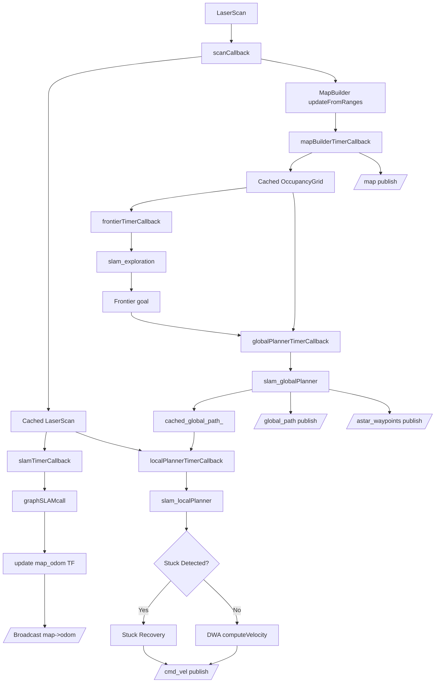

# ROS2 AMR Robot
## Tổng quan
Dự án AMR Robot là hệ thống robot tự hành được phát triển trên ROS 2, có khả năng tự xây dựng bản đồ, tự khám phá môi trường chưa biết và tự điều hướng mà không cần bản đồ có sẵn.

Hệ thống có các Components cơ bản dùng để kiểm tra di chuyển test topic, TF,...

Hệ thống sử dụng Graph-Based SLAM để tạo bản đồ Occupancy Grid, Frontier Exploration để lựa chọn khu vực cần khám phá, A* để lập kế hoạch đường đi và DWA để điều khiển robot di chuyển an toàn trong môi trường.

Luồng xử lý:

LiDAR → Graph SLAM → Occupancy Grid → Frontier Exploration → A* → DWA → Robot

## Tính năng
### ROS2 Components:
- Topic: publish & subscribe
- TF: publish & lookup
- Parameter
- Service
- Action
- Launch files
- URDF & XACRO
- Gazebo & RViz

### Core Algorithms:
- SLAM: dùng thuật toán Graph SLAM / Pose Graph Optimization: Tạo map, xác định vị trí của robot
- Exploration: dùng thuật toán Frontier-based: Chọn đường tốt nhất ( đường mà map chưa mở ) => Quyết định đi đâu tiếp theo 
- Global Planner: dùng thuật toán A star (A*) algorithm: Tìm đường tối ưu từ robot -> goal 
- Local Planner: dùng thuật toán Dynamic Window Approach (DWA): Điều khiển robot đi theo thực tế ( tránh vật cản realtime )

## Yêu cầu

- ROS2 Humble
- Gazebo (v11)
- RViz2

## AGV Pipeline



## Hình ảnh
Demo project di chuyển mô phỏng trong rviz2 


## Repository Structure
``` bash
AGV_Robot/
├── action/
├── config/
├── include/
│   ├── autonomous_exploration.h
│   └── slam_robot.h
│
├── launch/
│   ├── agv_robot.launch.py
│   ├── autonomous_slam.launch.py
│   ├── gazebo.launch.py
│   ├── navigation.launch.py
│   ├── rviz2.launch.py
│   └── slam.launch.py
├── library/
│   ├── Graph_SLAM/
│   ├── Frontier_Exploration/
│   ├── AStar/
│   └── DWA/
│
├── map/
├── rviz/
├── src/
│   ├── action_robot.cpp
│   ├── action_server.cpp
│   ├── autonomous_exploration.cpp
│   ├── navigation_robot.cpp
│   ├── robot_controller.cpp
│   ├── slam_robot.cpp
│   └── tf2_listener.cpp
│
├── urdf/
├── worlds/
└── README.md
```

## Tạo workspace

```bash
cd ...                 
mkdir -p ~/agv_robot
cd agv_robot
```
### Build
```bash
rosdep install -i --from-path src --rosdistro humble -y
colcon build
. install/setup.bash
```

## Các chương trình chạy test

### Điều khiển robot

```bash
# Trong terminal 1
ros2 launch agv_robot gazebo.launch.py

# Trong terminal 2 (điều khiển robot)
. install/setup.bash && ros2 run agv_robot robot_controller

# Trong terminal 3 (điều khiển action server)
. install/setup.bash && ros2 run agv_robot action_server

# Trong terminal 4 (điều khiển action client)
. install/setup.bash && ros2 action send_goal /move_robot agv_robot/action/MoveCmd "{command: 'up', value: 5}"        # Robot sẽ đi lên trên 5m
. install/setup.bash && ros2 action send_goal /move_robot agv_robot/action/MoveCmd "{command: 'down', value: 12}"     # Robot sẽ đi xuống dưới 12m
. install/setup.bash && ros2 action send_goal /move_robot agv_robot/action/MoveCmd "{command: 'circle', value: 1.37}" # Robot sẽ đi theo hình tròn với góc 1.37 radian
```

### SLAM
```bash
#Terminal
ros2 launch agv_robot autonomous_slam.launch.py

# Terminal 2 - Lưu file bản đồ
. install/setup.bash && ros2 run nav2_map_server map_saver_cli -f /home/hieu/Hieu/Project/AGV_Robot/map/map
```

### Navigation

```bash
cd ~/share/AGV_Robot
colcon build --packages-select agv_robot
source install/setup.bash

# Terminal 1
ros2 launch agv_robot gazebo.launch.py

# Terminal 2 (Khởi động Navigation)
. install/setup.bash && ros2 launch agv_robot navigation.launch.py

# Terminal 3 (Mở RViz Navigation)
. install/setup.bash && ros2 launch agv_robot rviz2.launch.py
. install/setup.bash && rviz2 -d /home/hieuubuntu/share/AGV_Robot/rviz/navigation.rviz

# Terminal 4 (Mở RViz Navigation)
. install/setup.bash && ros2 run agv_robot navigation_robot

```

```bash
# Chạy với Gazebo Room 1
export GAZEBO_MODEL_PATH=/home/<user_name>/experiment_rooms/models/
cd experiment_rooms/worlds/room1
gazebo world_dynamic.model
```

### Các lệnh debug:
```bash
ros2 run rqt_console rqt_console
rqt
ros2 topic list
ros2 node list
ros2 node info /slam_node
ros2 topic hz /scan
ros2 topic hz /cmd_vel
ros2 topic bw /scan
ros2 topic echo /tf_static --once
ros2 topic echo /odom
ros2 topic echo /map
ros2 topic echo /joint_states                                
ros2 topic echo /scan                                       
ros2 topic echo /cmd_vel                                    
ros2 topic echo /slam_robot/loop_closure_event
ros2 topic echo /agv_scan --once
ros2 topic echo /tf --once
ros2 topic echo /clock --once
ros2 run tf2_ros tf2_echo map base_link
ros2 run tf2_ros tf2_echo map odom
ros2 run tf2_ros tf2_echo odom base_link
ros2 run tf2_ros tf2_monitor
ros2 run tf2_tools view_frames
ros2 param get /rviz2 use_sim_time
ros2 param get /robot_state_publisher use_sim_time
ros2 param get /slam_node use_sim_time
ros2 param get /dwa_node use_sim_time
ros2 param get /frontier_node use_sim_time
```

## Roadmap
- Thêm khi chỉ vào 1 điểm ở trên map là robot sẽ tự đi đến
- Sử dụng ICP Scan Matching thay vì Odometry Edge đơn giản như hiện tại
- Sử dụng costmap cả Local lẫn Global cho các thuật toán A* và DWA 
- Thực hiện trên thực tế bằng Rapsberry Pi 4 và STM32 sẽ điều khiển làm tầng dưới
